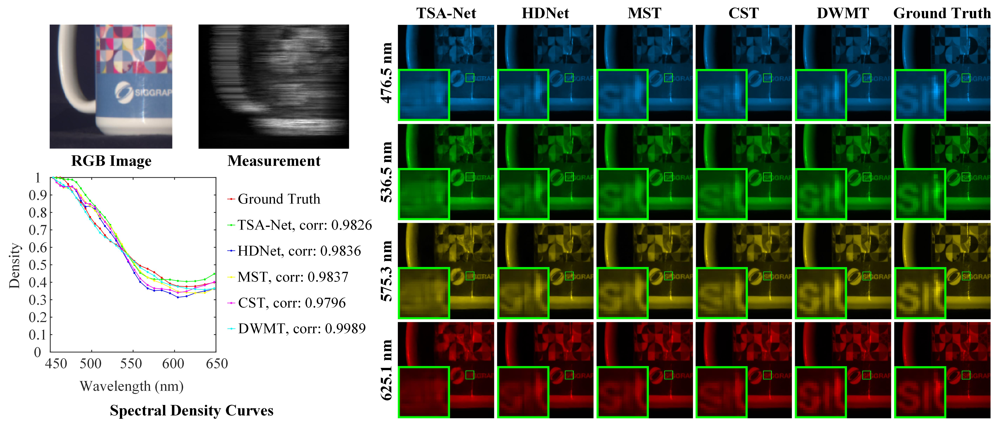

# DWMT for Hyperspectral Snapshot Compressive Imaging
This repo is the implementation of [Dual-Window Multiscale Transformer for Hyperspectral Snapshot Compressive Imaging](https://ojs.aaai.org/index.php/AAAI/article/view/28190) (AAAI2024).

# Acknowledgements
Our code is heavily borrows from [CST](https://arxiv.org/abs/2203.04845) (ECCV 2022) and [DAUHST](https://arxiv.org/abs/2205.10102) (NeurIPS 2022). Thanks to their generous open source efforts!

# Abstract
Coded aperture snapshot spectral imaging (CASSI) system is an effective manner for hyperspectral snapshot compressive imaging. The core issue of CASSI is to solve the inverse problem for the reconstruction of hyperspectral image (HSI). In recent years, Transformer-based methods achieve promising performance in HSI reconstruction. However, capturing both long-range dependencies and local information while ensuring reasonable computational costs remains a challenging problem. In this paper, we propose a Transformer-based HSI reconstruction method called dual-window multiscale Transformer (DWMT), which is a coarse-to-fine process, reconstructing the global properties of HSI with the long-range dependencies. In our method, we propose a novel U-Net architecture using a dual-branch encoder to refine pixel information and full-scale skip connections to fuse different features, enhancing the extraction of fine-grained features. Meanwhile, we design a novel self-attention mechanism called dual-window multiscale multi-head self-attention (DWM-MSA), which utilizes two different-sized windows to compute self-attention, which can capture the long-range dependencies in a local region at different scales to improve the reconstruction performance. We also propose a novel position embedding method for Transformer, named con-abs position embedding (CAPE), which effectively enhances positional information of the HSIs. Extensive experiments on both the simulated and the real data are conducted to demonstrate the superior performance, stability, and generalization ability of our DWMT.

# Comparison on Simulation Dataset
The performance are reported on 10 scenes of the KAIST dataset. The test size of FLOPS is 256 x 256.
## Quantitative Results

|                            Method                            | Params (M) | FLOPS (G) | PSNR  | SSIM  |
| :----------------------------------------------------------: | :--------: | :-------: | :---: | :---: |
| [TSA-Net](https://link.springer.com/chapter/10.1007/978-3-030-58592-1_12) |   44.25    |  110.06   | 31.46 | 0.894 |
|          [HDNet](https://arxiv.org/abs/2203.02149)           |    2.37    |  154.76   | 34.97 | 0.943 |
|           [MST](https://arxiv.org/abs/2111.07910)            |    2.03    |   28.15   | 35.18 | 0.948 |
|           [CST](https://arxiv.org/abs/2203.04845)            |    3.00    |   40.10   | 36.12 | 0.957 |
|                         DWMT (ours)                          |   14.48    |   46.71   | 36.82 | 0.964 |

## Qualitative Results


Download results of DWMT ([Google Drive](https://drive.google.com/drive/folders/1VGJCr6rOJkxt8GK0cpaSV_kCv7YU0QTU?usp=sharing)).

# Usage
## Prepare Dataset
Download cave_1024_28 ([Baidu Disk](https://pan.baidu.com/s/1X_uXxgyO-mslnCTn4ioyNQ), code: `fo0q` | [One Drive](https://bupteducn-my.sharepoint.com/:f:/g/personal/mengziyi_bupt_edu_cn/EmNAsycFKNNNgHfV9Kib4osB7OD4OSu-Gu6Qnyy5PweG0A?e=5NrM6S)), CAVE_512_28 ([Baidu Disk](https://pan.baidu.com/s/1ue26weBAbn61a7hyT9CDkg), code: `ixoe` | [One Drive](https://mailstsinghuaeducn-my.sharepoint.com/:f:/g/personal/lin-j21_mails_tsinghua_edu_cn/EjhS1U_F7I1PjjjtjKNtUF8BJdsqZ6BSMag_grUfzsTABA?e=sOpwm4)), KAIST_CVPR2021 ([Baidu Disk](https://pan.baidu.com/s/1LfPqGe0R_tuQjCXC_fALZA), code: `5mmn` | [One Drive](https://mailstsinghuaeducn-my.sharepoint.com/:f:/g/personal/lin-j21_mails_tsinghua_edu_cn/EkA4B4GU8AdDu0ZkKXdewPwBd64adYGsMPB8PNCuYnpGlA?e=VFb3xP)), TSA_simu_data ([Baidu Disk](https://pan.baidu.com/s/1LI9tMaSprtxT8PiAG1oETA), code: `efu8` | [One Drive](https://1drv.ms/u/s!Au_cHqZBKiu2gYFDwE-7z1fzeWCRDA?e=ofvwrD)), TSA_real_data ([Baidu Disk](https://pan.baidu.com/s/1RoOb1CKsUPFu0r01tRi5Bg), code: `eaqe` | [One Drive](https://1drv.ms/u/s!Au_cHqZBKiu2gYFTpCwLdTi_eSw6ww?e=uiEToT)), and then put them into the corresponding folders of `datasets/` and recollect them as the following form:

```shell
|--DWMT-main
    |--real
    	|-- test
    	|-- train
    |--simulation
    	|-- test
    	|-- train
    |--visualization
    |--datasets
        |--cave_1024_28
            |--scene1.mat
            |--scene2.mat
            ：  
            |--scene205.mat
        |--CAVE_512_28
            |--scene1.mat
            |--scene2.mat
            ：  
            |--scene30.mat
        |--KAIST_CVPR2021  
            |--1.mat
            |--2.mat
            ： 
            |--30.mat
        |--TSA_simu_data  
            |--mask.mat   
            |--Truth
                |--scene01.mat
                |--scene02.mat
                ： 
                |--scene10.mat
        |--TSA_real_data  
            |--mask.mat   
            |--Measurements
                |--scene1.mat
                |--scene2.mat
                ： 
                |--scene5.mat
```

Following CST and DAUHST, we use the CAVE dataset (cave_1024_28) as the simulation training set. Both the CAVE (CAVE_512_28) and KAIST (KAIST_CVPR2021) datasets are used as the real training set. 

## Simulation Experiement:
### Training
```shell
cd DWMT-main/simulation/train/

python train.py --template dwmt --outf ./exp/dwmt/ --method dwmt
```
The training log, trained model, and reconstrcuted HSI will be available in `DWMT-main/simulation/train/exp/` . 

### Testing
```python
cd DWMT-main/simulation/test/

python test.py --template dwmt --outf ./exp/dwmt/ --method dwmt --pretrained_model_path ./checkpoints/dwmt.pth
```

### Visualization	

- Put the reconstruted HSI in `DWMT-main/visualization/simulation_results/results` and rename it as method.mat.

- Generate the RGB images of the reconstructed HSIs.

## Real Experiement:

### Training

```shell
cd DWMT-main/real/train/

python train.py --template dwmt --outf ./exp/dwmt/ --method dwmt
```

The training log, trained model, and reconstrcuted HSI will be available in `DWMT-main/real/train/exp/`

### Testing	

```python
cd DWMT-main/real/test/

python test.py --template dwmt --outf ./exp/dwmt/ --method dwmt --pretrained_model_path ./checkpoints/dwmt.pth
```

- The reconstrcuted HSI will be output into `DWMT-main/real/test/exp/`  


###　Visualization	

- Put the reconstruted HSI in `--pretrained_model_path ./checkpoints/dwmt.pth/visualization/real_results/results` and rename it as method.mat, e.g., mst_plus_plus.mat.

- Generate the RGB images of the reconstructed HSI.

# Citation
If this code helps you, please consider citing our work:
```shell
@inproceedings{luo2024dual,
  title={Dual-Window Multiscale Transformer for Hyperspectral Snapshot Compressive Imaging},
  author={Luo, Fulin and Chen, Xi and Gong, Xiuwen and Wu, Weiwen and Guo, Tan},
  booktitle={Proceedings of the AAAI Conference on Artificial Intelligence},
  volume={38},
  number={4},
  pages={3972--3980},
  year={2024}
}
```
